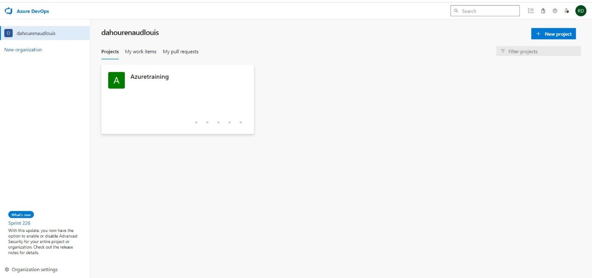
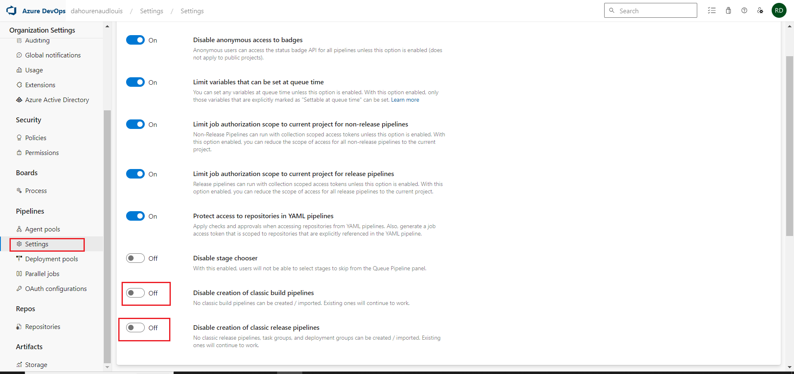
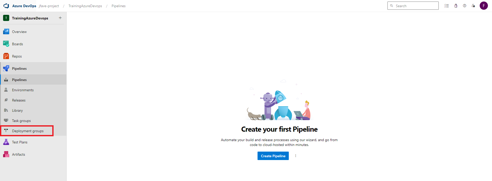
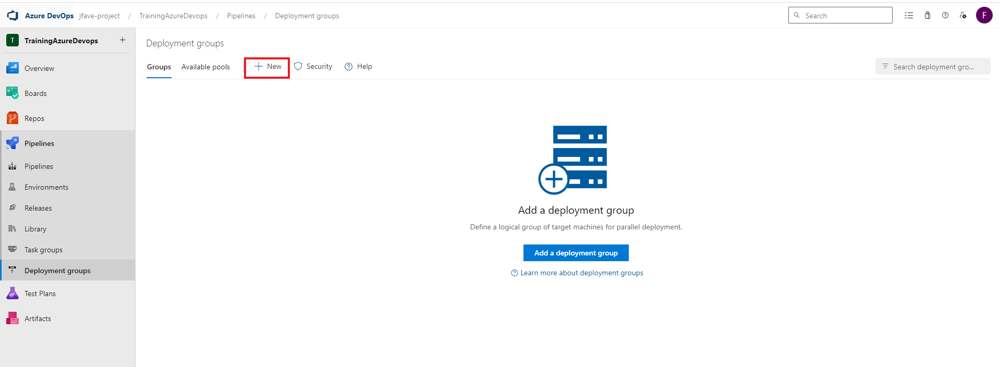
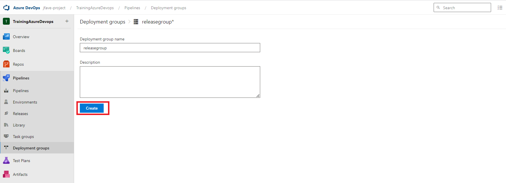
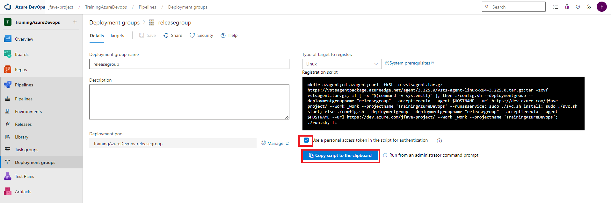
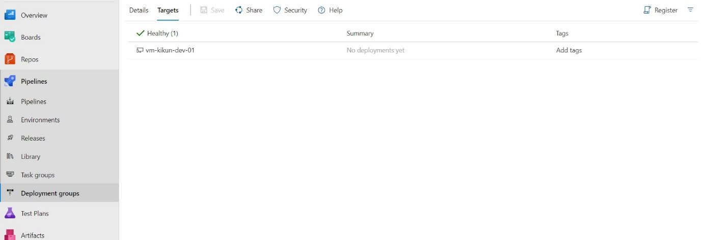

### Activation des paramètres de release sur l'organisation si ce n'est pas le cas (passer en off)







## Créez un groupe de deploiement






### ``INSTRUCTION``


### ``* Connectez-vous en SSH sur votre vm de release exécutez ce script``

### ``* Vous aurez une sortie similaire dans le groupe de déploiement en fonction du nom de votre machine  avec l'état Healthy``





```python

```
