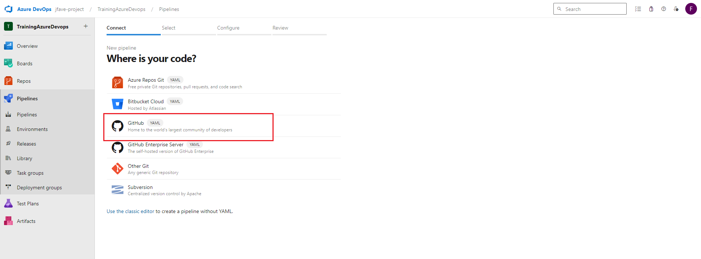
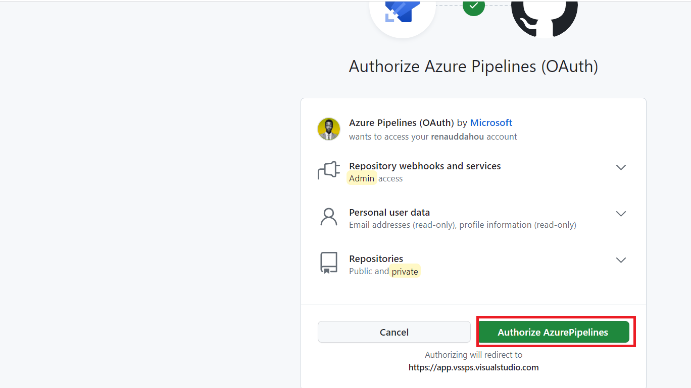
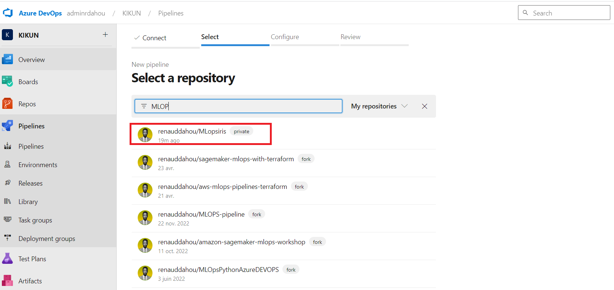
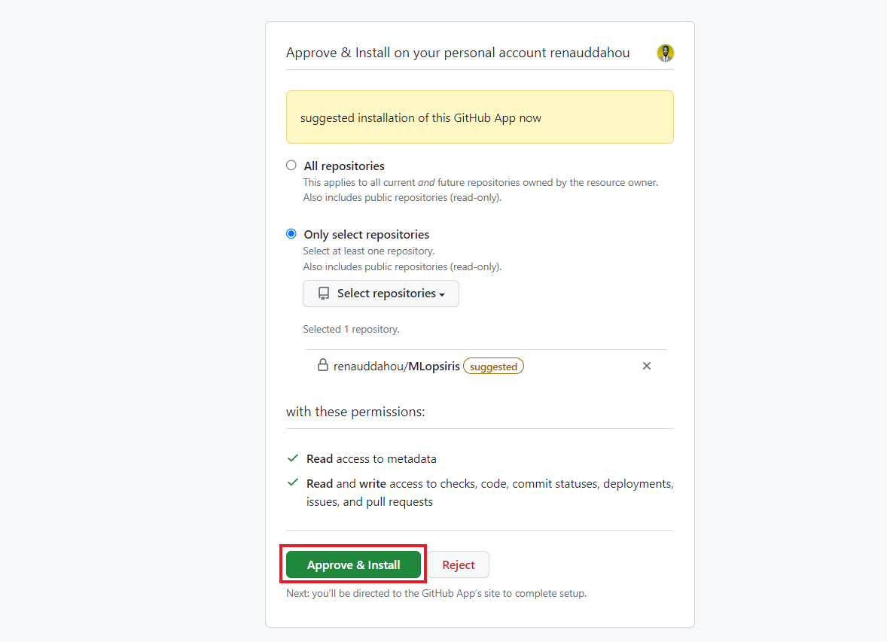

## Création de pipeline






#### ``Nous allons ensemble construire ce pipeline  de bout en bout afin de builder, tester  et publier  notre application``

```
# Starter pipeline
# Start with a minimal pipeline that you can customize to build and deploy your code.
# Add steps that build, run tests, deploy, and more:
# https://aka.ms/yaml

trigger:
- main

pool:
  name: Default


steps:
- script: echo Hello, world!
  displayName: 'Run a one-line script'

- script: |
    echo Add other tasks to build, test, and deploy your project.
    echo See https://aka.ms/yaml
  displayName: 'Run a multi-line script'

- task: CopyFiles@2
  inputs:
    SourceFolder: '$(Build.SourcesDirectory)'
    Contents: '**'
    TargetFolder: '$(Build.ArtifactStagingDirectory)'

- task: CmdLine@2
  displayName: 'Test code quality'
  inputs:
    script: |
      echo Test code quality
      python -m pip install yapf flake8
      python -m yapf -i app.py
      python -m flake8 app.py
    workingDirectory: '$(Build.ArtifactStagingDirectory)'
  continueOnError: false
  
- task: CmdLine@2
  displayName: 'Build Docker images'
  inputs:
    script: |
      echo Build Docker images
      docker build -t flaskapp .
    workingDirectory: '$(Build.ArtifactStagingDirectory)'
  continueOnError: false
- task: CmdLine@2
  displayName: 'Test container'
  inputs:
    script: |
      echo Test container
      docker run --rm -p 8000:8000 flaskapp bash -c "python3 app.py & sleep 3 && curl -X POST -d 'name=Renaud' http://localhost:5000/hello"
    workingDirectory: '$(Build.ArtifactStagingDirectory)'
  continueOnError: false

- task: CmdLine@2
  displayName: 'save docker images'
  inputs:
    script: |
      echo Test container
      docker save flaskapp > flaskapp.tar
    workingDirectory: '$(Build.BinariesDirectory)'
  continueOnError: false


- task: PublishBuildArtifacts@1
  displayName: 'Publish artifact'
  inputs:
    PathtoPublish: '$(Build.BinariesDirectory)/flaskapp.tar'
    ArtifactName: 'flaskapp'
    publishLocation: 'Container'
  continueOnError: false
```


#version d'artifact


```

- task: PowerShell@2
  displayName: 'Generate Version'
  inputs:
    targetType: 'inline'
    script: |
      $buildId = "$(Build.BuildId)"
      $date = Get-Date -Format "yyyyMMdd"
      $version = "1.0.$date.$buildId"
      Write-Host "##vso[task.setvariable variable=BuildVersion]$version"
      Write-Host "Generated version: $version"

- task: CopyFiles@2
  inputs:
    SourceFolder: '$(Build.SourcesDirectory)'
    Contents: '**'
    TargetFolder: '$(Build.ArtifactStagingDirectory)'

- task: CmdLine@2
  displayName: 'Test code quality'
  inputs:
    script: |
      echo Test code quality
      python -m pip install yapf flake8
      python -m yapf -i app.py
      python -m flake8 app.py
    workingDirectory: '$(Build.ArtifactStagingDirectory)'
  continueOnError: false
  
- task: CmdLine@2
  displayName: 'Build Docker images'
  inputs:
    script: |
      echo Build Docker images
      docker build -t flaskapp:$(BuildVersion) .
    workingDirectory: '$(Build.ArtifactStagingDirectory)'
  continueOnError: false
- task: CmdLine@2
  displayName: 'Test container'
  inputs:
    script: |
      echo Test container
      docker run --rm -p 8000:8000 flaskapp bash -c "python3 app.py & sleep 3 && curl -X POST -d 'name=Renaud' http://localhost:5000/hello"
    workingDirectory: '$(Build.ArtifactStagingDirectory)'
  continueOnError: false


- task: CmdLine@2
  displayName: 'save docker images'
  inputs:
    script: |
      echo "Saving Docker image with version $(BuildVersion)"
      docker save flaskapp:$(BuildVersion) > flaskapp_$(BuildVersion).tar
    workingDirectory: '$(Build.BinariesDirectory)'

- task: PublishBuildArtifacts@1
  displayName: 'Publish artifact'
  inputs:
    PathtoPublish: '$(Build.BinariesDirectory)/flaskapp_$(BuildVersion).tar'
    ArtifactName: 'flaskapp'
    publishLocation: 'Container'

```


````
# Starter pipeline
# Start with a minimal pipeline that you can customize to build and deploy your code.
# Add steps that build, run tests, deploy, and more:
# https://aka.ms/yaml

trigger:
- main   #notre pipeline se declechera quand un commit est constaté sur la branche main

#pool:
  #vmImage: ubuntu-latest

pool:
  name: Default

steps:
- script: echo Hello, world!
  displayName: 'Run a one-line script'

- script: |
    echo Add other tasks to build, test, and deploy your project.
    echo See https://aka.ms/yaml
  displayName: 'Run a multi-line script'
````


- **`$(Build.SourcesDirectory)`** (ou **dossier `s`**) est utilisé pour la compilation.
- **`$(Build.BinariesDirectory)`** contient les fichiers binaires créés par la compilation.
- **`$(Agent.BuildDirectory)`** (ou dossier b) est utilisé pour stocker les résultats des test
- **`$(Build.ArtifactStagingDirectory)`** (ou **dossier `a`**) est utilisé pour les artefacts publiés.

```
# Starter pipeline
# Start with a minimal pipeline that you can customize to build and deploy your code.
# Add steps that build, run tests, deploy, and more:
# https://aka.ms/yaml

trigger:
- main

pool:
  name: Default


steps:
- script: echo Hello, world!
  displayName: 'Run a one-line script'

- script: |
    echo Add other tasks to build, test, and deploy your project.
    echo See https://aka.ms/yaml
  displayName: 'Run a multi-line script'

- task: CopyFiles@2
  inputs:
    SourceFolder: '$(Build.SourcesDirectory)'
    Contents: '**'
    TargetFolder: '$(Build.ArtifactStagingDirectory)'

- task: ArchiveFiles@2
  inputs:
    rootFolderOrFile: '$(Build.SourcesDirectory)'
    includeRootFolder: false
    archiveType: 'zip'
    archiveFile: '$(Build.ArtifactStagingDirectory)/application.zip'
    replaceExistingArchive: true

- task: PublishBuildArtifacts@1
  displayName: 'Publish artifact'
  inputs:
    PathtoPublish: '$(Build.ArtifactStagingDirectory)'
    ArtifactName: 'Myapp'
    publishLocation: 'Container'
  continueOnError: false

```

