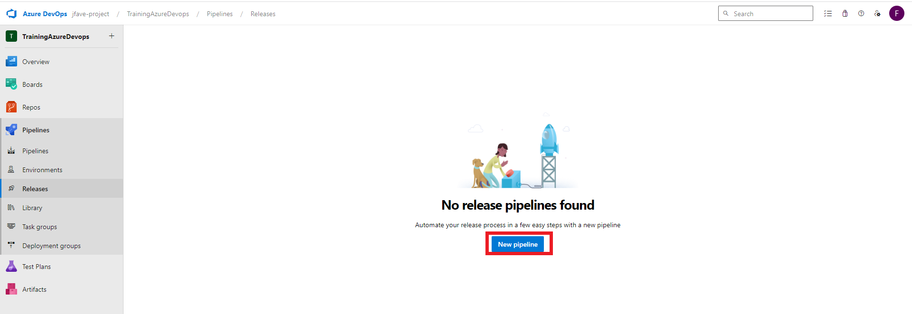
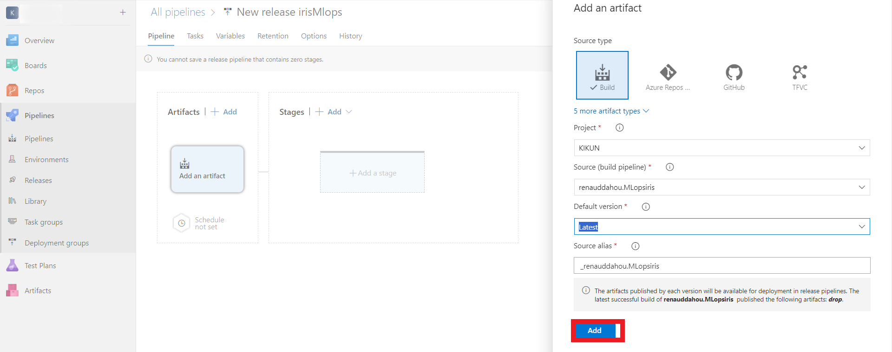
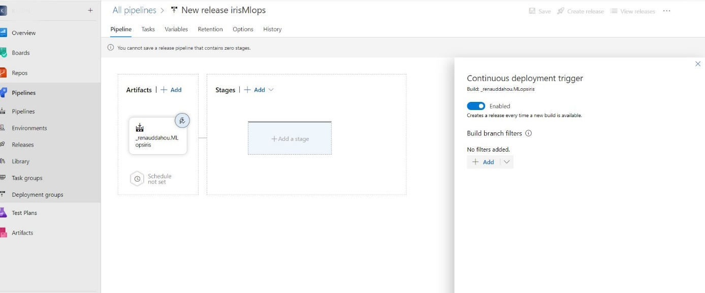
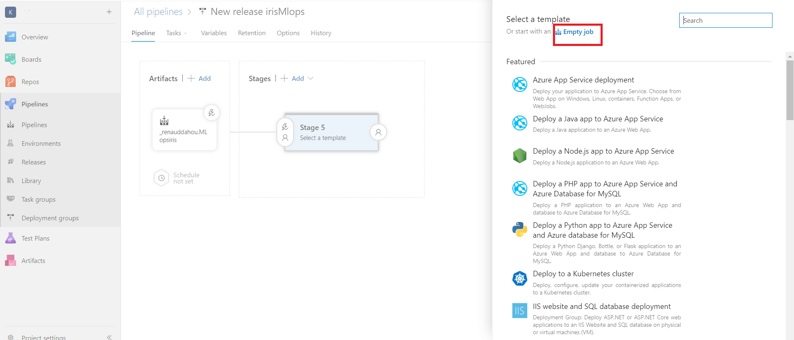
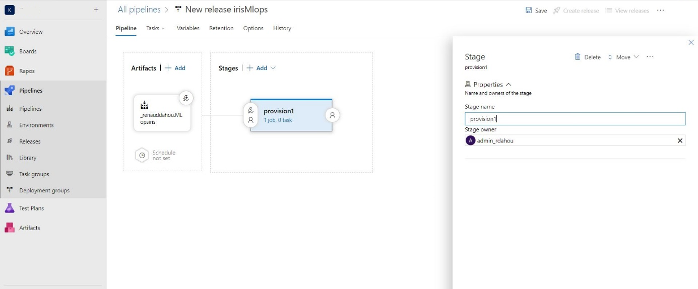
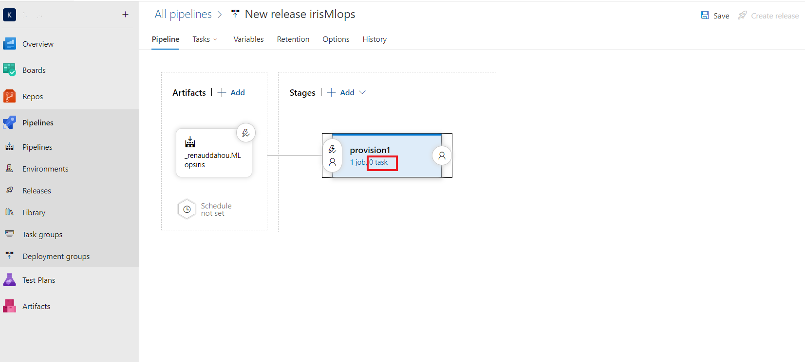
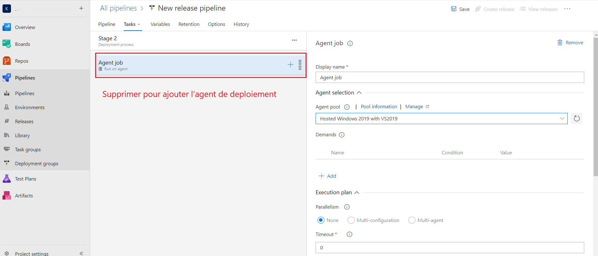
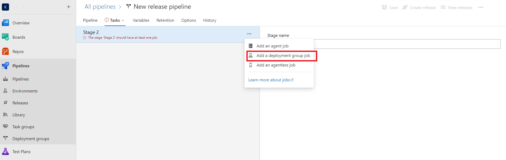

# Créez un release











````
#!/bin/bash

# Vérifier si Docker est déjà installé
if ! command -v docker &> /dev/null; then
    echo "Docker n'est pas installé. Installation de Docker..."

    # Mettre à jour les paquets
    sudo apt update -y

    # Installer les dépendances nécessaires
    sudo apt install -y apt-transport-https ca-certificates curl software-properties-common

    # Ajouter la clé GPG pour le dépôt Docker
    curl -fsSL https://download.docker.com/linux/ubuntu/gpg | sudo apt-key add -

    # Ajouter le dépôt Docker
    sudo add-apt-repository "deb [arch=amd64] https://download.docker.com/linux/ubuntu bionic stable"

    # Mettre à jour la liste des paquets après avoir ajouté le dépôt
    sudo apt update -y

    # Installer Docker
    sudo apt install -y docker-ce
else
    echo "Docker est déjà installé."
fi

# Vérifier si le service Docker est actif
if sudo systemctl is-active --quiet docker; then
    echo "Le service Docker est actif."
else
    echo "Démarrage du service Docker..."
    sudo systemctl start docker
fi

# Ajouter l'utilisateur au groupe Docker
sudo usermod -aG docker azureuser

# Charger l'image Docker
sudo docker load -i flaskapp_*.tar

# Taguer l'image avec le dernier tag
LAST_TAG=$(sudo docker images --format '{{.Repository}}:{{.Tag}}' | grep 'flaskapp' | sort -V | tail -n 2)

# Vérifier si LAST_TAG est vide ou non
if [ -z "$LAST_TAG" ]; then
    echo "Erreur : Aucun tag trouvé pour l'image flaskapp."
    exit 1  # Sortir avec un code d'erreur
else
    echo "Dernier tag trouvé : $LAST_TAG"
    sudo docker tag "$LAST_TAG" flaskapp:latest
fi


# Supprimer le conteneur existant
sudo docker rm -f myflask

# Exécuter le conteneur
sudo docker run -d -p 5000:8000 --name myflask flaskapp


````


